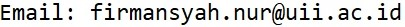

<!--default layout: default-->

  

    
    &nbsp;
  

  

    
<b>Firmansyah Nur Budiman</b>

    
Lecturer 
    <a href="https://ee.uii.ac.id/" target="_blank">Department of Electrical Engineering</a> 
    <a href="https://www.uii.ac.id/" target="_blank">Universitas Islam Indonesia</a> 
    Jl. Kaliurang Km 14.5 Sleman 
    Yogyakarta 55584

    
    
 

  

## Bio

I'm a lecturer in <a href="https://ee.uii.ac.id/" target="_blank">electrical engineering</a> at <a href="https://www.uii.ac.id/" target="_blank">Universitas Islam Indonesia</a>, but currently doing PhD at <a href="https://www.kau.edu.sa/home_ENGLISH.aspx" target="_blank">King Abdulaziz University</a>. Yes, I officially have two "homes" now.

As part of my PhD, I'm working on the stochastic scheduling of microgrid. Microgrid operation is subject to high-degree uncertainties produced by different sources, due to which deterministic optimization is unrealistic. This motivates me to seek an optimal framework of stochastic optimization deployment.

## Education
* Ph.D in Electrical Engineering, <a href="https://www.kau.edu.sa/home_ENGLISH.aspx">King Abdulaziz University</a>, 2020-now
* M.Sc. in Electrical Engineering, <a href="https://ksu.edu.sa/en/">King Saud University</a>, 2010-2013
  * Thesis: Particle-Initiated Partial Discharge Detection in Gas-Insulated Substation
  * Advisors: Professors <a href="https://www.researchgate.net/profile/Yasin-Khan-5">Yasin Khan</a> and <a href="https://www.ec-lyon.fr/en/contacts/abderrahmane-beroual">Abderrahmane Beroual</a>
* B.Eng. in Electrical Engineering, <a href="https://ugm.ac.id/">Universitas Gadjah Mada</a>, 2005-2009

## Scholarship Awards
* Ph.D Scholarship from <a href="https://www.kau.edu.sa/home_ENGLISH.aspx">King Abdulaziz University</a>, 2020-now
* M.Sc. Scholarship from <a href="https://ksu.edu.sa/en/">King Saud University</a>, 2010-2013

## Areas of Interest
* Detection and pattern recognition of partial discharge in high-voltage apparatuses
* Stochastic optimization of microgrids and power systems

## Work Experiences
* Lecturer at <a href="https://www.uii.ac.id/">Universitas Islam Indonesia</a>, 2015-now
* Academic Intern at <a href="https://ugm.ac.id/">Universitas Gadjah Mada</a>, 2013-2015
* Research Assistant at <a href="https://ksu.edu.sa/en/">King Saud University</a>, 2012-2013
  
## Programming Skills
* MATLAB
* Python
* Julia

## PhD Courses Completed at KAU
* EE701 Advanced Stochastic Processes
* EE702 Advanced Linear Systems
* EE703 Advanced Modeling, Simulation, and Optimization
* EE704 Advanced Reliability
* EE720 Electromagnetic Compatibility and Power Quality
* EE724 Distributed Generations
* EE725 Dielectric Phenomena in High Voltage Equipments

## Courses Taught at UII
* Electric Power Systems
* Power Transmission and Distribution
* Power System Operation
* Power System Control
* Electric Circuit
* Introduction to Electrical Engineering
* Power Electronics

## Publications

### 2022

* **Optimal sizing of grid-connected photovoltaic system for a large commercial load in Saudi Arabia**  
    M. M. A. Seedahmed, M. A. M. Ramli, H. R. E. H. Bouchekara, A. H. Milyani, M. Rawa, <u>F. N. Budiman</u>, R. F. Muktiadji, and S. M. Ul Hassan  
    *Alexandria Engineering Journal*, Vol. 61, Issue 8, 2021  
    DOI: <a href="https://doi.org/10.1016/j.aej.2021.12.013" target="_blank">10.1016/j.aej.2021.12.013</a>

### 2021
* **Dimensional analysis of partial discharge initiated by a metallic particle adhering to the spacer surface in a gas-insulated system**  
    <u>F. N. Budiman</u> and A. M. Rushdi  
    *Communications in Science and Technology*, Vol. 6, No. 2, 2021  
    DOI: <a href="https://doi.org/10.21924/cst.6.2.2021.556" target="_blank">10.21924/cst.6.2.2021.556</a>

### 2020
* **Pemanfaatan Energi Terbarukan untuk Pembangkit Listrik Tenaga Surya Berbasis Komunitas: Menuju Desa Mandiri Energi**  
    E. S. Wahyuni, H. Mubarok, <u>F. N. Budiman</u>, and S. W. Pratomo  
    *Engagement: Jurnal Pengabdian Kepada Masyarakat*, Vol. 4, No. 2, pp. 493-508, 2020  
    DOI: <a href="https://doi.org/10.29062/engagement.v4i2.181" target="_blank">10.29062/engagement.v4i2.181</a>

* **Design and Implementation of Series Resonant DC-DC Converter**  
    <u>F. N. Budiman</u> and A. Amrad  
    *Jurnal Nasional Teknik Elektro*, Vol. 9, No. 1, pp. 28-33, 2020  
    DOI: <a href="https://doi.org/10.25077/jnte.v9n1.736.2020" target="_blank">10.25077/jnte.v9n1.736.2020</a>

### 2018
* **Total Harmonic Distortion Comparison between Sinusoidal PWM Inverter and Multilevel Inverter in Solar Panel**  
    <u>F. N. Budiman</u> and M. R. Ramadhani  
    *Kinetik*, Vol. 3, No. 3, pp. 191-202, 2018  
    DOI: <a href="https://doi.org/10.22219/kinetik.v3i3.617" target="_blank">10.22219/kinetik.v3i3.617</a>

### 2016
* **Discrimination of particle-initiated defects in gas-insulated system using C4.5 algorithm**  
    <u>F. N. Budiman</u> and E. S. Wahyuni  
    In *Proc. 3rd International Conference on Information Technology, Computer, and Electrical Engineering*, pp. 191-196, 2016  
    DOI: <a href="https://doi.org/10.1109/ICITACEE.2016.7892437" target="_blank">10.1109/ICITACEE.2016.7892437</a>

* **Application of Genetic Algorithm to Minimize Harmonic in Multilevel Inverter**  
    <u>F. N. Budiman</u>, N. A. Windarko, and S. Kuswadi  
    *Jurnal Nasional Teknik Elektro*, Vol. 5, No. 1, pp. 73-79, 2016  
    DOI: <a href="https://doi.org/10.25077/jnte.v5n1.192.2016" target="_blank">10.25077/jnte.v5n1.192.2016</a>

### 2014
* **Partial discharge pattern analysis using support vector machine to estimate size and position of metallic particle adhering to spacer in GIS**  
    Y. Khan, A. A. Khan, <u>F. N. Budiman</u>, A. Beroual, N. H. Malik, and A. A. Al-Arainy  
    *Electric Power Systems Research*, Vol. 116, pp. 391-398, 2014  
    DOI: <a href="https://doi.org/10.1016/j.epsr.2014.07.001" target="_blank">10.1016/j.epsr.2014.07.001</a>

* **Partial discharge analysis using PCA and ANN for the estimation of size and position of metallic particle adhering to spacer in Gas-Insulated System**  
    <u>F. N. Budiman</u> and Y. Khan  
    In *Proc. 6th International Conference on Information Technology and Electrical Engineering*, pp. 325-330, 2014  
    DOI: <a href="https://doi.org/10.1109/ICITEED.2014.7007947" target="_blank">10.1109/ICITEED.2014.7007947</a>

* **Effect of Charging and Position of Metallic Particle Adhered to Spacer on PDIV and PRPD Characteristics in GIS**  
    Y. Khan, A. A. Khan, <u>F. N. Budiman</u>, A. Beroual, N. H. Malik, and A. A. Al-Arainy  
    *Research Journal of Applied Sciences, Engineering and Technology*, Vol. 8, No. 3, pp. 331-340, 2014  
    DOI: <a href="https://doi.org/10.19026/rjaset.8.977" target="_blank">10.19026/rjaset.8.977</a>

### 2013
* **Utilization of artificial neural network for the estimation of size and position of metallic particle adhering to spacer in GIS**  
    <u>F. N. Budiman</u>, Y. Khan, N. H. Malik, A. A. Al-Arainy, and A. Beroual  
    *IEEE Transactions on Dielectrics and Electrical Insulation*, Vol. 20, No. 6, 2013  
    DOI: <a href="https://doi.org/10.1109/TDEI.2013.6678863" target="_blank">10.1109/TDEI.2013.66788637</a>

* **The estimation of size and position of contaminating particle adhering to the insulating spacer surface in gas-insulated systems**  
    Y. Khan, <u>F. N. Budiman</u>, A. Beroual, N. H. Malik, and A. A. Al-Arainy  
    *The European Physical Journal Applied Physics*, Vol. 62, No. 2, 2013  
    DOI: <a href="https://doi.org/10.1051/epjap/2013130007" target="_blank">10.1051/epjap/2013130007</a>

* **Estimation of particle initiated PD inception voltage around spacer in GIS**  
    <u>F. N. Budiman</u>, Y. Khan, A. A. Al-Arainy, N. H. Malik, and A. Beroual  
    In *Proc. 4th International Conference on Power Engineering, Energy and Electrical Drives*, pp. 517-521, 2013  
    DOI: <a href="https://doi.org/10.1109/PowerEng.2013.6635662" target="_blank">10.1109/PowerEng.2013.6635662</a>

* **Dependence of Particle Initiated PD Characteristics on Size and Position of Metallic Particle Adhering to the Spacer Surface in GIS**  
    <u>F. N. Budiman</u>, Y. Khan, A. A. Khan, A. Beroual, N. H. Malik, and A. A. Al-Arainy  
    *International Journal of Electrical and Computer Engineering*, Vol. 7, No. 3, pp. 349-353, 2013  
    DOI: <a href="https://doi.org/10.5281/zenodo.1083637" target="_blank">10.5281/zenodo.1083637</a>

---

See also: <a href="https://scholar.google.com/citations?user=0nmKrPAAAAAJ&hl=en" target="_blank">Google Scholar</a> / <a href="https://www.researchgate.net/profile/Firmansyah-Nur-Budiman" target="_blank">ResearchGate</a>